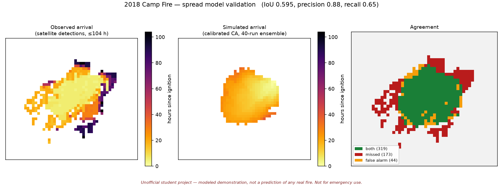
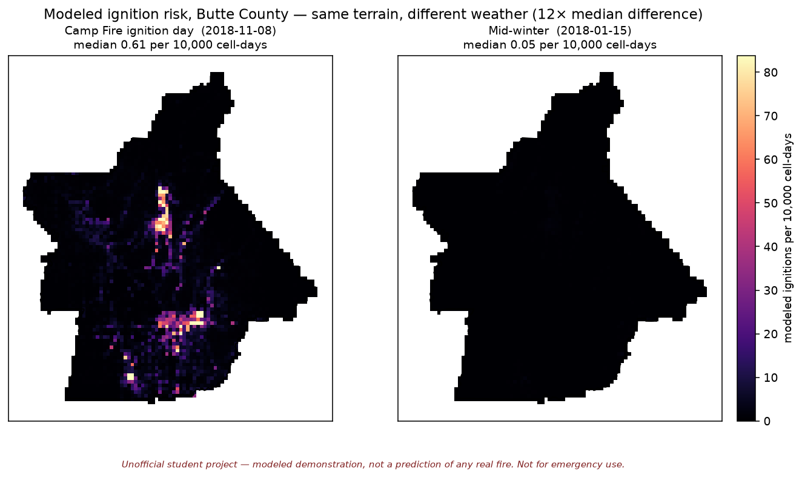

# California Wildfire Risk & Spread Simulation — Butte County

> # ⚠️ UNOFFICIAL PORTFOLIO PROJECT — NOT A SOURCE OF REAL FIRE INFORMATION
>
> This is a personal student/portfolio project. It is **not affiliated with,
> endorsed by, or reviewed by** CAL FIRE, Butte County OES, NASA, USGS, or any
> emergency management agency.
>
> **Do not use or cite this project as a source of real wildfire information.
> Do not let it inform any emergency, evacuation, or safety decision.**
>
> - The risk map and spread simulation are **modeled demonstrations**. They are
>   not predictions of any actual fire's behavior, past or future.
> - The live layer shows **unverified satellite thermal detections** from NASA
>   FIRMS — subject to false positives (industrial heat, gas flares, glint) and
>   to detection lag. It is **not** a confirmed incident feed.
> - This project does **not** model or publish evacuation zones.
>
> **Official incident information → <https://www.fire.ca.gov/incidents/>**
> **In an emergency, call 911.**

---

An end-to-end geospatial data science project: predicting where wildfires
start, simulating how they spread, validating both against a real catastrophic
fire, and serving it all from a live public web map on entirely free
infrastructure.

**Study area:** Butte County, California (4,344 km², 1 km grid → 4,547 cells)
**Calibration event:** the 2018 Camp Fire (153,336 acres, 85 deaths)

## Results

| Model | Metric | Result | Baseline |
|---|---|---|---|
| Ignition risk | PR-AUC (spatially blocked CV) | **0.226** | 0.048 (4.7×) |
| Ignition risk | ROC-AUC | 0.853 | 0.500 |
| Ignition risk | Calibration (mean predicted vs true) | 0.011659% vs 0.011821% | — |
| Fire spread | IoU vs observed Camp Fire extent | **0.595** | — |
| Fire spread | Precision / Recall | 0.879 / 0.648 | — |
| Fire spread | Arrival-time MAE | **11.1 h** (bias +0.85 h) | — |

Full write-ups: [ignition model](docs/ignition_model_report.md) ·
[spread model](docs/spread_model_report.md)

### Spread validation against the 2018 Camp Fire



### The risk model responds to weather, not just terrain



Identical terrain and fuel; only the weather differs. Median modeled risk is
**12× higher** on the Camp Fire ignition day than in mid-winter, and peak risk
~57× higher.

## What I'd point a reviewer at

**1. PR-AUC is reported, not ROC-AUC.** True prevalence is 0.012% — one
ignition per ~8,300 cell-days. At that imbalance ROC-AUC stays flattering
(0.853) for a model of modest usefulness. PR-AUC of 0.226 against a 0.048
baseline is the number that means something.

**2. Validation is spatially blocked, and scores *worse* than temporal CV**
(0.226 vs 0.284). Neighbouring 1 km cells share terrain, fuel, and weather, so
a random split scores near-duplicate rows and reports a number that says
nothing about new ground. Spatial CV scoring *higher* would have signalled
leakage.

**3. The comparison window for spread was chosen so it couldn't flatter.** The
simulation covers 104 h of wind; the FRAP perimeter is the final extent ~400 h
after ignition. Scoring one against the other would guarantee under-prediction.
The target is the 492 cells burned **and** first detected within the simulated
window. The unfair full-perimeter IoU (0.511) is reported anyway, labelled as
unfair.

**4. Circular variables are handled as vectors everywhere.** Wind direction,
terrain aspect, and day-of-year are all circular. Averaging wind direction
arithmetically over Butte on 2018-11-08 gives 219.5° against a true circular
mean of 118.0° — a 100° error, because values span 108°–354° across the 0/360
wrap. Wind is stored as u/v components, aspect as northness/eastness, season as
sin/cos, so every downstream aggregation is correct by construction.

**5. Where the spread model measurably fails.** Principal-axis analysis of the
burn shapes:

| | Observed | Simulated |
|---|---|---|
| Elongation ratio | 1.44 | 1.10 |
| Major axis bearing | 63° | 71° |

The model gets the *direction* roughly right — both align with the NE→SW wind
axis (wind from 49°) — but produces a fire **1.31× too round**. That is the
absence of spotting showing up as measurable geometry: ember cast is strongly
downwind-directional, and an adjacency-only automaton cannot reproduce it at
any parameter setting.

## Architecture

```
Phase 1  INGEST      TIGER · FRAP · FPA-FOD · LANDFIRE · gridMET · HRRR · FIRMS
                          │
Phase 2  FEATURES    1 km grid (EPSG:3310) ── 48 features ── HistGradientBoosting
                          │                                   spatially blocked CV
Phase 3  SPREAD      cellular automaton ── calibrated on the Camp Fire
                          │                 (HRRR hourly wind, satellite arrival times)
Phase 4  LIVE        GitHub Actions (~15 min) ──▶ live-data branch ──▶ raw URL
                          │
Phase 5  APP         Streamlit + Leaflet/folium — risk, click-to-simulate, live layer
```

## Data sources

All free and public. Full provenance, licences, field definitions, and known
limitations: **[docs/data_dictionary.md](docs/data_dictionary.md)**.

| Layer | Source | Resolution | Coverage |
|---|---|---|---|
| County boundary | US Census TIGER/Line 2024 | vector | — |
| Fire perimeters | CAL FIRE FRAP | vector | 364 fires, 1911–2025 |
| Ignition points | USFS FPA-FOD (Short, RDS-2013-0009.6) | point | 7,532 in Butte, 1992–2020 |
| Terrain & fuel | LANDFIRE (USGS/USFS) | 30 m | LF2016 fuel / LF2020 topo |
| Daily weather | gridMET (Climatology Lab) | 4 km daily | 2015–2020, 12 variables |
| Hourly wind | NOAA HRRR (AWS Open Data) | 3 km hourly | Camp Fire window |
| Live detections | NASA FIRMS | 375 m / 1 km | statewide, near-real-time |

Three source choices that materially changed the result:

- **FPA-FOD over FRAP for ignition labels.** FRAP is size-thresholded and gave
  only 39 fires for 2016–2020; FPA-FOD gave **1,000**, of which 920 are under
  10 acres and structurally invisible to FRAP.
- **HRRR over gridMET for spread wind.** gridMET's 4 km daily field gives 114°
  (ESE) for the Camp Fire ignition day; HRRR gives **43° (NE)** and reproduces
  the documented Jarbo Gap downslope event — 18.9 mph sustained with 38 mph
  gusts at ignition, peaking at 52.9 mph gusts mid-morning.
- **LANDFIRE over USGS 3DEP for terrain.** LANDFIRE publishes elevation, slope,
  and aspect on the *same* 30 m grid as its fuel products, eliminating
  cross-source resampling error between terrain and fuel.

## Honest limitations

These are load-bearing, not boilerplate.

**Ignition model**
1. **It largely tracks human access.** Distance to development is by far the
   strongest predictor (permutation importance ~5× the next feature), because
   two thirds of Butte ignitions are human-caused. A remote, bone-dry cell can
   score low simply because nobody is there to start a fire. **It predicts
   reported ignition, not fire danger.**
2. **Labels are positionally noisy.** FPA-FOD points are often snapped to
   section or quarter-section centroids — errors of a few hundred metres
   against 1 km cells.
3. **Cause is unknown for half the sample** (515 of 1,000).
4. **"Discovery" is not ignition.** Report time correlates with terrain and
   access, so remote fires carry a detection delay.
5. **Five years, one county**, including two exceptional seasons. Transfer is
   untested.

**Spread model**

6. **No spotting.** The single largest error source, quantified above.
7. **No suppression.** Thousands of firefighters worked the Camp Fire; the
   model has no containment lines, retardant, or structure defence.
8. **The target is satellite-derived, not ground truth.** Detections are
   quantised to overpasses, miss fire under cloud and smoke, and carry
   geolocation error comparable to a cell width. 79 burned cells were never
   detected at all and are excluded from timing error.
9. **Calibrated on exactly one fire**, with no independent validation.
10. **Interactive scenarios use daily wind**, coarser than the hourly HRRR used
    for calibration, so they are rougher than the headline metrics imply.
11. **1 km cells and 30 m fuel from 2016** are coarse for behaviour governed by
    canyon and ridge structure and by pre-fire vegetation.

## Running it

```bash
git clone <your-repo-url> && cd ca-wildfire-sim
python3 -m venv .venv && source .venv/bin/activate
pip install -r requirements.txt
streamlit run app/streamlit_app.py
```

The app runs from committed data alone — no downloads needed.

### Rebuilding from raw sources

```bash
python -m src.ingest.county_boundary
python -m src.ingest.fire_perimeters
python -m src.ingest.ignitions          # needs the FPA-FOD download, see docstring
python -m src.ingest.landfire
python -m src.ingest.weather
python -m src.ingest.hrrr_wind
python -m src.ingest.firms_archive
python -m src.features.grid
python -m src.features.build_training_table
python -m src.model.train_ignition
python -m src.spread.domain
python -m src.spread.calibrate
```

~1.9 GB of raw downloads, all gitignored and cached — re-running skips
completed work.

### Live data

Needs a free [FIRMS MAP_KEY](https://firms.modaps.eosdis.nasa.gov/api/area/) as
a repository secret named `FIRMS_MAP_KEY`. Setup and operational caveats:
**[docs/live_pipeline.md](docs/live_pipeline.md)**.

The transform pipeline can be tested without a key:

```bash
python -m tests.test_firms_pipeline
```

## Repository layout

```
app/                  Streamlit application
src/ingest/           download and clean scripts, one per source
src/features/         1 km grid construction and feature engineering
src/model/            ignition risk model + surface prediction
src/spread/           cellular automaton, domain builder, calibration
src/live/             FIRMS fetch (Actions) and loader (app)
tests/                pipeline self-test, no API key required
docs/                 data dictionary, model reports, figures
data/processed/       committed derived artefacts (~42 MB)
data/raw/, interim/   gitignored, regenerable
.github/workflows/    scheduled FIRMS refresh
```

## Tech stack

Python · geopandas · rasterio · xarray · scikit-learn · pandas · numpy ·
Streamlit · folium/Leaflet · GitHub Actions

Free tier throughout — no paid database, map tiles, or hosting. Leaflet rather
than Mapbox to avoid usage-based billing.

## Author

**Sayed Omar Hashimi** — sole author and contributor.

---

> **Reminder:** unofficial student project. Not affiliated with CAL FIRE, Butte
> County OES, NASA, or any emergency agency. Not for emergency, evacuation, or
> safety decisions. Official information:
> <https://www.fire.ca.gov/incidents/> · Emergencies: **911**.
